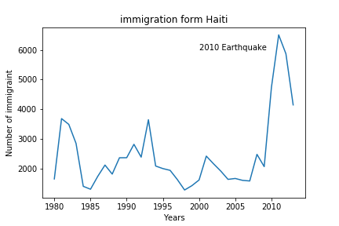
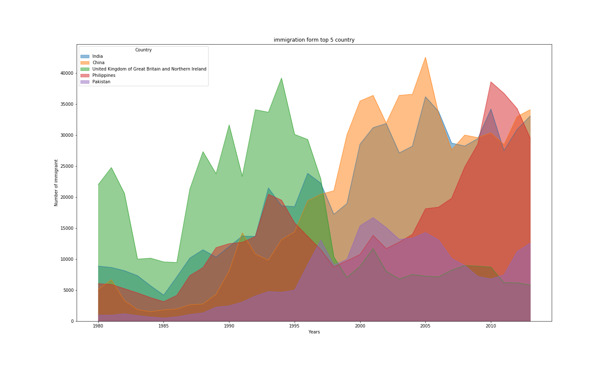
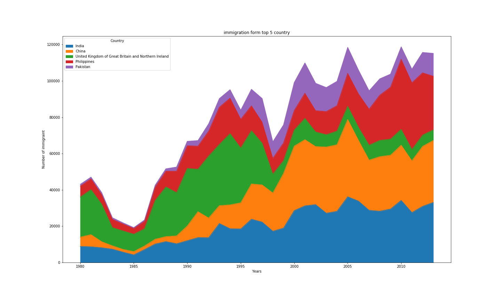
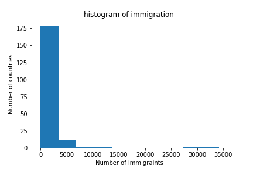
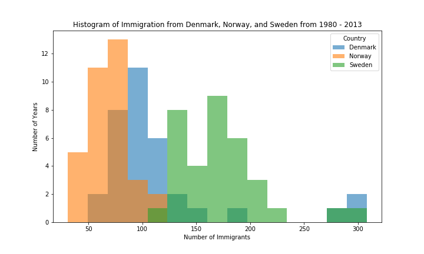
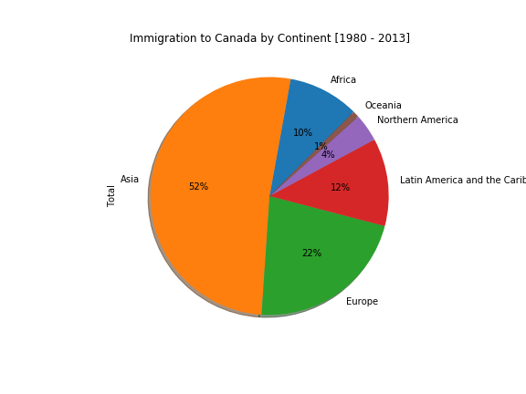
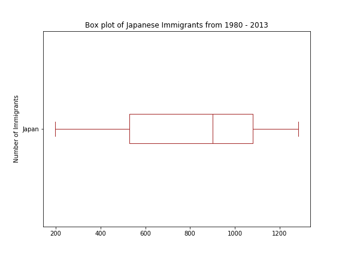
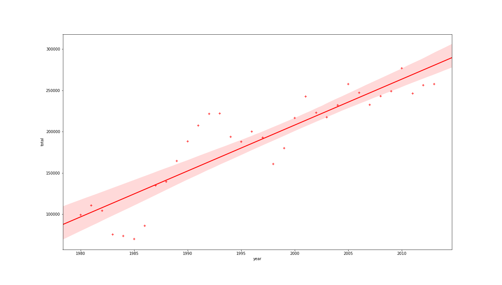

# Data Visualization with Python

After finishing [data visualization with python](https://www.coursera.org/learn/python-for-data-visualization) course that took place  Oct in 2018 at coursera platform by IBM , I decided to take summary of the whole course to help me to remember and to anyone who would like to know about it. I've skipped some contents in some lectures as it wasn't important to me. 
## Table of contents

* [Data Visualization with Python](#data-visualization-with-python)
   * [Table of contents](#table-of-contents)
   * [Course Info](#course-info)
   * [01. Introduction to Data Visualization Tools](#01-introduction-to-data-visualization-tools)
   * [02. Basic and Specialized Visualization Tools](#02-basic-and-specialized-visualization-tools)
   * [03. Advanced Visualizations and Geospatial Data](#03-advanced-visualizations-and-geospatial-data)


## Course Info

- Website: https://www.coursera.org/learn/python-for-data-visualization/

- Full syllabus link: https://www.coursera.org/learn/python-for-data-visualization/#syllabus

- DataSet: [Immigration to Canada from 1980 to 2013](https://ibm.box.com/shared/static/lw190pt9zpy5bd1ptyg2aw15awomz9pu.xlsx)

- [Quizes solutions](quizes/)

- [CodeBase for all weeks](weeks/) 

- Number of Weeks : **3**

- courseLab : https://labs.cognitiveclass.ai/tools/jupyterlab/ 

- Course description:

  - > The main goal of this Data Visualization with Python course is to teach you how to take data that at first glance has little meaning and present that data in a form that makes sense to people. Various techniques have been developed for presenting data visually but in this course, we will be using several data visualization libraries in Python, namely Matplotlib, Seaborn, and Folium.


## 01. Introduction to Data Visualization Tools

- A brief history of matplotlib architecture and the  creator of it Johan Hunter. it consists of three layers:
    - Backend Layer (FigureCanves , Render , Events )
    - Artist Layer  Knowns how  to use render to draw on the canves . and you can programming with it,but it hard.
    - Script Layer (pyplot) : module bulit on matplotlib which make life easy in data visualization with python.

- To enforce the jupyter notebook to draw/ render the figure within window not in separate window , you  must  used    magic fnction  `** %matplotlib inline **` as first line of your code.

- Learn How to import matplotlib and using its functions to draw point  , line  , area , ..... etc .
    - Plot point in 2D :
         - `import matplotlib as plt
            plt.plot(5,5,'o')
            plt.show()`
    - In codebase directory : find code for ploting multiply plots .

- Once you draw a figure couldn't  edit it , so you must adding title , xlabel ,ylabel , color ,  .... etc  before     drawing .

- Also in the week you hands with pandas library through dataset about **Immigration to Canada from 1980 to 2013**
  ,  which contain immigrants from each country to canada over the period from 1980 to 2013. we use it to draw many chart with semantics to  help data analysis to take decision .

- Line plots: 
    - is a type of plot which displays information as a series of data points called ‘markers’ connected by                straight line segments.
    - These are best suited for trend-based visualization of data over a period of time.
    - default sacked parameter ***False*.  
    - Example 
                line plot ex1      |      line plot ex2       |    line plot ex3
        :-------------------------:|:-------------------------:-------------------------
                |  >      |  

## 02. Basic and Specialized Visualization Tools
- You learn plots such as
    
    - Area plots: visualize line plot as a cumulative plot, also know as a **Stacked Line Plot** or Area Plot. 
        - alpha parameter is the transparency indicator.
        - Example
                area plot ex1      |      area plot ex2       |
        :-------------------------:|:-------------------------:
                  |  >      |

    - Histograms :
        - a way of representing the frequency distribution of numeric dataset.
        - The way it works is it partitions the x-axis into bins, assigns each data point in our dataset to a bin,     and then counts the number of data points that have been assigned to each bin. So the y-axis is the          frequency or the number of data points in each bin.
        - Example :
           histogram plot ex1      |      histogram plot ex2
        :-------------------------:|:-------------------------:
                  |  >      |


    - Bar chart:
        - is a way of representing data where the length of the bars represents the     
          magnitude/size of the feature/variable.
        - there are two kind of bar charts : vertical and horizontal.
        - Example :
            

    -Pie chart : is a circular graphic that displays numeric proportions by dividing a circle (or pie) into                       proportional slices.
        -Example: 
            
    
    - Box Plots :
        - is a way of statistically representing the distribution of the data through
            - five main dimensions :
                - Min (the smallest number in dataset)
                - first quarter(25%).
                - Median(50%).
                - third quarter(75%).
                - Max(the largest number in the dataset)
        - used to determine the outlier of data distribution.
        - Example :
            

    - Scatter(2D) :  
        - is a useful method of comparing variables against each other
        - look similar to line plots in that they both map independent and dependent variables on a 2D graph .
        - The data in a scatter plot is considered to express a trend
        - Example :
            
   
    - Bubble scatter : 
        - the variation of scatter plot that display in 3D .


## 03. Advanced Visualizations and Geospatial Data
- Waffle Charts :
    - is an interesting visualization that is normally created to display progress toward goals .
- Word Clouds:
    - (also known as text clouds or tag clouds) work in a simple way: the more a specific word  
       appears in a source of textual data (such as a speech, blog post, or database), the bigger and bolder it appears in the word cloud.

-**Regression Plots** : 
    - is the scatter plot along with the regression fit line .
    - here we are using seaborn library that can create regplot in few lines of code.
        * ```import seaborn as sns
             ax = sns.regplot(x='year', y='total', data=df_tot)```
    - Example : 
        


<br><br>
<br><br>

Thanks for:
    - [Markdown Cheatsheet](https://github.com/adam-p/markdown-here/wiki/Markdown-Cheatsheet)
    - [Mbadry1 template of cs231 summary](https://github.com/mbadry1/CS231n-2017-Summary)
    - [Data visualization Blog ](http://cican17.com/data-visualization-with-python/)


- These notes was made by [Ahmed Ramadan](mailto:ar1521@fayoum.edu.ed)@2018

